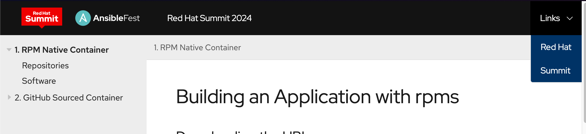
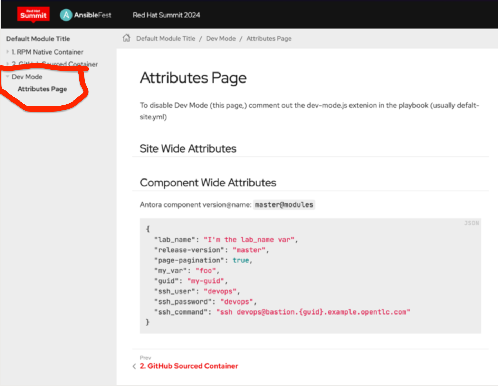

= vLLM Showroom

This repository contains the source code and documentation for the vLLM Master Class. It provides all the materials, examples, and instructions needed to follow along with the course.

== Getting Started

Current live version can be seen here:

https:= Deploying a Model with vLLM

In this section will will deploy a https://huggingface.co/ibm-granite/granite-3.0-8b-instruct[Granite 3.0 8B Instruct] model using vLLM.

For our Model Server we will be deploying a vLLM instance using a model packaged into an OCI container with ModelCar.

[NOTE]
====
ModelCar is Tech Preview as of OpenShift AI 2.14.

ModelCar is a great option for smaller models like our 8B model.  While it is still a relatively large container (15Gb) it is still reasonable to easily pull into a cluster.

Treating the model as an OCI artifa= Deploying a Model with vLLM

In this section will will deploy a https://huggingface.co/ibm-granite/granite-3.0-8b-instruct[Granite 3.0 8B Instruct] model using vLLM.

For our Model Server we will be deploying a vLLM instance using a model packaged into an OCI container with ModelCar.

[NOTE]
====
ModelCar is Tech Preview as of OpenShift AI 2.14.

ModelCar is a great option for smaller models like our 8B model.  While it is still a relatively large container (15Gb) it is still reasonable to easily pull into a cluster.

Treating the model as an OCI artifact allows us to easily promote the model between different environments using customers existing promotion processes.  By contrast, dealing with promoting models between S3 instances in different environments may create new challenges.
====

== Creating the vLLM Instance

. Open the https://rhods-dashboard-redhat-ods-applications.{openshift_cluster_ingress_domain}[OpenShift AI Dashboard] and select the `composer-ai-apps` project from the list of Data Science Projects

+
image::02-composer-ai-apps-project.png[Composer AI Apps Project]

. Select the `Models` tab and click `Select single-model`

+
image::02-single-model.png[Single Model]

. Select `Deploy models`

+
image::02-deploy-models.png[Deploy Models]

. Enter the following information:

+
[source,yaml]
----
Model deployment name: vllm
Serving runtime: vLLM ServingRuntime for KServe
Number of model server replicas to deploy: 1
Model server size: Custom
CPUs requested: 2 Cores
CPUs limit: 4 Cores
Memory requested: 16 GiB
Memory limit: 20 GiB
Accelerator: nvidia-gpu
Number of accelerators: 1
Make deployed models available through an external route: Checked
Require token authentication: Unchecked
----

+
[Important]
====
The name of the model server must be `vllm` in order for some of the configurations in Composer AI to match up correctly.
====

+
image::02-model-options.png[Model Options]

. In the `Source model location` section, choose the option to `Create connection`.  Enter the following information:

+
[source,yaml]
----
Connection type: URI - v1
Connection name: granite-3-0-8b-instruct
URI: oci://quay.io/redhat-ai-services/modelcar-catalog:granite-3.0-8b-instruct
----

+
image::02-uri-connection.png[URI Connection]

+
[NOTE]
====
You can find the image container our model https://github.com/redhat-ai-services/modelcar-catalog/[here] alongside other ModelCar images that you can try.

Additionally, the source for building these ModelCar images can be found on https://github.com/redhat-ai-services/modelcar-catalog/[GitHub].

For more information on ModelCar see the KServe https://kserve.github.io/website/latest/modelserving/storage/oci/[Serving models with OCI images] documentation.
====

+
[TIP]
====
A copy of the image has already been pulled onto the GPU node to help speed up deploying the model, but deploying LLMs can take quite some time.

KServe uses KNative Serverless to manage the model servers which has a default timeout of 10 minutes which means that if the model server takes longer than 10 minutes to deploy it will automatically terminate the pod and mark it as failed.

You can extend the timeout by adding the following annotation to the `predictor` section of the `InferenceService`:

[source,yaml]
----
apiVersion: serving.kserve.io/v1beta1
kind: InferenceService
metadata:
  name: vllm
spec:
  predictor:
    annotations:
      serving.knative.dev/progress-deadline: 30m
----
====

. A new vLLM instance will be created in the OpenShift AI Dashboard.  Return to the https://console-openshift-console.{openshift_cluster_ingress_domain}/k8s/ns/composer-ai-apps/core%7Ev1%7EPod?name=vllm-predictor[OpenShift Web Console] and check the pods in the `composer-ai-apps` project.  You should find a pod called `vllm-predictor-00001-deployment-*`.  Check the pods `Events` and `Logs` to follow the progress for the pod until it becomes ready.

. (Optional) The OpenShift AI Dashboard created two KServe objects, a `ServingRuntime` and an `InferenceService`.  From the OpenShift Web Console, navigate to the `Home` > `Search` page and use the `Resources` drop down menu to search for and select those objects.  Spend a few minutes reviewing the objects created by the Dashboard.

+
image::02-kserve-objects.png[KServe Objects]

== Testing vLLM Endpoints

=== Accessing the Swgger Docs

To start will test our vLLM endpoint to make sure it is responding by accessing the Swagger docs for vLLM.

. To start we will need to find the endpoint URL for the served model.  From the OpenShift AI Dashboard, navigate to the Models tab and click on the `Internal and external endpoint details` to find the URL.

+
image::02-model-endpoint.png[Model endpoint]

+
[NOTE]
====
Our vLLM instance does not create a normal OpenShift route so you won't find it under the normal `Networking` > `Routes` menu.  

Instead it creates a KNative Serving Route object which can be found in `Serverless` > `Serving` or with the following:

----
oc get routes.serving.knative.dev -n composer-ai-apps
----
====

. Use the `copy` option for the route found in the previous step and paste it into a new tab with `/docs` at the end to access a FastAPI Swagger Docs page for vLLM.

. Use the `Try it out` option of the `GET /v1/models` endpoint to list the models being deployed by this server.  Note that the id for our model matches the name of the model server we created in the OpenShift AI Dashboard.

[WARNING]
====
Running into a 404 error on the OCP web console after trying this?  Let us know to help identify a bug.

Possible fixes include switching wifi networks, switching to Incognito mode, or deleting cookies and cache.
====

=== Testing the model from Composer AI UI

Now that we have done some basic testing we are ready to try the model from inside of the Composer AI Studio UI.

Our Composer instance is already setup to point to the vLLM endpoint we created so no additional configuration is required.

. Find the `chatbot-ui` Route from the OpenShift Web Console and open it as a new tab.

+
image::02-chatbot-route.png[Chatbot Route]
= Deploying a Model with vLLM

In this section will will deploy a https://huggingface.co/ibm-granite/granite-3.0-8b-instruct[Granite 3.0 8B Instruct] model using vLLM.

For our Model Server we will be deploying a vLLM instance using a model packaged into an OCI container with ModelCar.

[NOTE]
====
ModelCar is Tech Preview as of OpenShift AI 2.14.

ModelCar is a great option for smaller models like our 8B model.  While it is still a relatively large container (15Gb) it is still reasonable to easily pull into a cluster.

Treating the model as an OCI artifact allows us to easily promote the model between different environments using customers existing promotion processes.  By contrast, dealing with promoting models between S3 instances in different environments may create new challenges.
====

== Creating the vLLM Instance

. Open the https://rhods-dashboard-redhat-ods-applications.{openshift_cluster_ingress_domain}[OpenShift AI Dashboard] and select the `composer-ai-apps` project from the list of Data Science Projects

+
image::02-composer-ai-apps-project.png[Composer AI Apps Project]

. Select the `Models` tab and click `Select single-model`

+
image::02-single-model.png[Single Model]

. Select `Deploy models`

+
image::02-deploy-models.png[Deploy Models]

. Enter the following information:

+
[source,yaml]
----
Model deployment name: vllm
Serving runtime: vLLM ServingRuntime for KServe
Number of model server replicas to deploy: 1
Model server size: Custom
CPUs requested: 2 Cores
CPUs limit: 4 Cores
Memory requested: 16 GiB
Memory limit: 20 GiB
Accelerator: nvidia-gpu
Number of accelerators: 1
Make deployed models available through an external route: Checked
Require token authentication: Unchecked
----

+
[Important]
====
The name of the model server must be `vllm` in order for some of the configurations in Composer AI to match up correctly.
====

+
image::02-model-options.png[Model Options]

. In the `Source model location` section, choose the option to `Create connection`.  Enter the following information:

+
[source,yaml]
----
Connection type: URI - v1
Connection name: granite-3-0-8b-instruct
URI: oci://quay.io/redhat-ai-services/modelcar-catalog:granite-3.0-8b-instruct
----

+
image::02-uri-connection.png[URI Connection]

+
[NOTE]
====
You can find the image container our model https://github.com/redhat-ai-services/modelcar-catalog/[here] alongside other ModelCar images that you can try.

Additionally, the source for building these ModelCar images can be found on https://github.com/redhat-ai-services/modelcar-catalog/[GitHub].

For more information on ModelCar see the KServe https://kserve.github.io/website/latest/modelserving/storage/oci/[Serving models with OCI images] documentation.
====

+
[TIP]
====
A copy of the image has already been pulled onto the GPU node to help speed up deploying the model, but deploying LLMs can take quite some time.

KServe uses KNative Serverless to manage the model servers which has a default timeout of 10 minutes which means that if the model server takes longer than 10 minutes to deploy it will automatically terminate the pod and mark it as failed.

You can extend the timeout by adding the following annotation to the `predictor` section of the `InferenceService`:

[source,yaml]
----
apiVersion: serving.kserve.io/v1beta1
kind: InferenceService
metadata:
  name: vllm
spec:
  predictor:
    annotations:
      serving.knative.dev/progress-deadline: 30m
----
====

. A new vLLM instance will be created in the OpenShift AI Dashboard.  Return to the https://console-openshift-console.{openshift_cluster_ingress_domain}/k8s/ns/composer-ai-apps/core%7Ev1%7EPod?name=vllm-predictor[OpenShift Web Console] and check the pods in the `composer-ai-apps` project.  You should find a pod called `vllm-predictor-00001-deployment-*`.  Check the pods `Events` and `Logs` to follow the progress for the pod until it becomes ready.

. (Optional) The OpenShift AI Dashboard created two KServe objects, a `ServingRuntime` and an `InferenceService`.  From the OpenShift Web Console, navigate to the `Home` > `Search` page and use the `Resources` drop down menu to search for and select those objects.  Spend a few minutes reviewing the objects created by the Dashboard.

+
image::02-kserve-objects.png[KServe Objects]

== Testing vLLM Endpoints

=== Accessing the Swgger Docs

To start will test our vLLM endpoint to make sure it is responding by accessing the Swagger docs for vLLM.

. To start we will need to find the endpoint URL for the served model.  From the OpenShift AI Dashboard, navigate to the Models tab and click on the `Internal and external endpoint details` to find the URL.

+
image::02-model-endpoint.png[Model endpoint]

+
[NOTE]
====
Our vLLM instance does not create a normal OpenShift route so you won't find it under the normal `Networking` > `Routes` menu.  

Instead it creates a KNative Serving Route object which can be found in `Serverless` > `Serving` or with the following:

----
oc get routes.serving.knative.dev -n composer-ai-apps
----
====

. Use the `copy` option for the route found in the previous step and paste it into a new tab with `/docs` at the end to access a FastAPI Swagger Docs page for vLLM.

. Use the `Try it out` option of the `GET /v1/models` endpoint to list the models being deployed by this server.  Note that the id for our model matches the name of the model server we created in the OpenShift AI Dashboard.

[WARNING]
====
Running into a 404 error on the OCP web console after trying this?  Let us know to help identify a bug.

Possible fixes include switching wifi networks, switching to Incognito mode, or deleting cookies and cache.
====

=== Testing the model from Composer AI UI

Now that we have done some basic testing we are ready to try the model from inside of the Composer AI Studio UI.

Our Composer instance is already setup to point to the vLLM endpoint we created so no additional configuration is required.

. Find the `chatbot-ui` Route from the OpenShift Web Console and open it as a new tab.

+
image::02-chatbot-route.png[Chatbot Route]
= Deploying a Model with vLLM

In this section will will deploy a https://huggingface.co/ibm-granite/granite-3.0-8b-instruct[Granite 3.0 8B Instruct] model using vLLM.

For our Model Server we will be deploying a vLLM instance using a model packaged into an OCI container with ModelCar.

[NOTE]
====
ModelCar is Tech Preview as of OpenShift AI 2.14.

ModelCar is a great option for smaller models like our 8B model.  While it is still a relatively large container (15Gb) it is still reasonable to easily pull into a cluster.

Treating the model as an OCI artifact allows us to easily promote the model between different environments using customers existing promotion processes.  By contrast, dealing with promoting models between S3 instances in different environments may create new challenges.
====

== Creating the vLLM Instance

. Open the https://rhods-dashboard-redhat-ods-applications.{openshift_cluster_ingress_domain}[OpenShift AI Dashboard] and select the `composer-ai-apps` project from the list of Data Science Projects

+
image::02-composer-ai-apps-project.png[Composer AI Apps Project]

. Select the `Models` tab and click `Select single-model`

+
image::02-single-model.png[Single Model]

. Select `Deploy models`

+
image::02-deploy-models.png[Deploy Models]

. Enter the following information:

+
[source,yaml]
----
Model deployment name: vllm
Serving runtime: vLLM ServingRuntime for KServe
Number of model server replicas to deploy: 1
Model server size: Custom
CPUs requested: 2 Cores
CPUs limit: 4 Cores
Memory requested: 16 GiB
Memory limit: 20 GiB
Accelerator: nvidia-gpu
Number of accelerators: 1
Make deployed models available through an external route: Checked
Require token authentication: Unchecked
----

+
[Important]
====
The name of the model server must be `vllm` in order for some of the configurations in Composer AI to match up correctly.
====

+
image::02-model-options.png[Model Options]

. In the `Source model location` section, choose the option to `Create connection`.  Enter the following information:

+
[source,yaml]
----
Connection type: URI - v1
Connection name: granite-3-0-8b-instruct
URI: oci://quay.io/redhat-ai-services/modelcar-catalog:granite-3.0-8b-instruct
----

+
image::02-uri-connection.png[URI Connection]

+
[NOTE]
====
You can find the image container our model https://github.com/redhat-ai-services/modelcar-catalog/[here] alongside other ModelCar images that you can try.

Additionally, the source for building these ModelCar images can be found on https://github.com/redhat-ai-services/modelcar-catalog/[GitHub].

For more information on ModelCar see the KServe https://kserve.github.io/website/latest/modelserving/storage/oci/[Serving models with OCI images] documentation.
====

+
[TIP]
====
A copy of the image has already been pulled onto the GPU node to help speed up deploying the model, but deploying LLMs can take quite some time.

KServe uses KNative Serverless to manage the model servers which has a default timeout of 10 minutes which means that if the model server takes longer than 10 minutes to deploy it will automatically terminate the pod and mark it as failed.

You can extend the timeout by adding the following annotation to the `predictor` section of the `InferenceService`:

[source,yaml]
----
apiVersion: serving.kserve.io/v1beta1
kind: InferenceService
metadata:
  name: vllm
spec:
  predictor:
    annotations:
      serving.knative.dev/progress-deadline: 30m
----
====

. A new vLLM instance will be created in the OpenShift AI Dashboard.  Return to the https://console-openshift-console.{openshift_cluster_ingress_domain}/k8s/ns/composer-ai-apps/core%7Ev1%7EPod?name=vllm-predictor[OpenShift Web Console] and check the pods in the `composer-ai-apps` project.  You should find a pod called `vllm-predictor-00001-deployment-*`.  Check the pods `Events` and `Logs` to follow the progress for the pod until it becomes ready.

. (Optional) The OpenShift AI Dashboard created two KServe objects, a `ServingRuntime` and an `InferenceService`.  From the OpenShift Web Console, navigate to the `Home` > `Search` page and use the `Resources` drop down menu to search for and select those objects.  Spend a few minutes reviewing the objects created by the Dashboard.

+
image::02-kserve-objects.png[KServe Objects]

== Testing vLLM Endpoints

=== Accessing the Swgger Docs

To start will test our vLLM endpoint to make sure it is responding by accessing the Swagger docs for vLLM.

. To start we will need to find the endpoint URL for the served model.  From the OpenShift AI Dashboard, navigate to the Models tab and click on the `Internal and external endpoint details` to find the URL.

+
image::02-model-endpoint.png[Model endpoint]

+
[NOTE]
====
Our vLLM instance does not create a normal OpenShift route so you won't find it under the normal `Networking` > `Routes` menu.  

Instead it creates a KNative Serving Route object which can be found in `Serverless` > `Serving` or with the following:

----
oc get routes.serving.knative.dev -n composer-ai-apps
----
====

. Use the `copy` option for the route found in the previous step and paste it into a new tab with `/docs` at the end to access a FastAPI Swagger Docs page for vLLM.

. Use the `Try it out` option of the `GET /v1/models` endpoint to list the models being deployed by this server.  Note that the id for our model matches the name of the model server we created in the OpenShift AI Dashboard.

[WARNING]
====
Running into a 404 error on the OCP web console after trying this?  Let us know to help identify a bug.

Possible fixes include switching wifi networks, switching to Incognito mode, or deleting cookies and cache.
====

=== Testing the model from Composer AI UI

Now that we have done some basic testing we are ready to try the model from inside of the Composer AI Studio UI.

Our Composer instance is already setup to point to the vLLM endpoint we created so no additional configuration is required.

. Find the `chatbot-ui` Route from the OpenShift Web Console and open it as a new tab.
= Deploying a Model with vLLM

In this section will will deploy a https://huggingface.co/ibm-granite/granite-3.0-8b-instruct[Granite 3.0 8B Instruct] model using vLLM.

For our Model Server we will be deploying a vLLM instance using a model packaged into an OCI container with ModelCar.

[NOTE]
====
ModelCar is Tech Preview as of OpenShift AI 2.14.

ModelCar is a great option for smaller models like our 8B model.  While it is still a relatively large container (15Gb) it is still reasonable to easily pull into a cluster.

Treating the model as an OCI artifact allows us to easily promote the model between different environments using customers existing promotion processes.  By contrast, dealing with promoting models between S3 instances in different environments may create new challenges.
====

== Creating the vLLM Instance

. Open the https://rhods-dashboard-redhat-ods-applications.{openshift_cluster_ingress_domain}[OpenShift AI Dashboard] and select the `composer-ai-apps` project from the list of Data Science Projects

+
image::02-composer-ai-apps-project.png[Composer AI Apps Project]

. Select the `Models` tab and click `Select single-model`

+
image::02-single-model.png[Single Model]

. Select `Deploy models`

+
image::02-deploy-models.png[Deploy Models]

. Enter the following information:

+
[source,yaml]
----
Model deployment name: vllm
Serving runtime: vLLM ServingRuntime for KServe
Number of model server replicas to deploy: 1
Model server size: Custom
CPUs requested: 2 Cores
CPUs limit: 4 Cores
Memory requested: 16 GiB
Memory limit: 20 GiB
Accelerator: nvidia-gpu
Number of accelerators: 1
Make deployed models available through an external route: Checked
Require token authentication: Unchecked
----

+
[Important]
====
The name of the model server must be `vllm` in order for some of the configurations in Composer AI to match up correctly.
====

+
image::02-model-options.png[Model Options]

. In the `Source model location` section, choose the option to `Create connection`.  Enter the following information:

+
[source,yaml]
----
Connection type: URI - v1
Connection name: granite-3-0-8b-instruct
URI: oci://quay.io/redhat-ai-services/modelcar-catalog:granite-3.0-8b-instruct
----

+
image::02-uri-connection.png[URI Connection]

+
[NOTE]
====
You can find the image container our model https://github.com/redhat-ai-services/modelcar-catalog/[here] alongside other ModelCar images that you can try.

Additionally, the source for building these ModelCar images can be found on https://github.com/redhat-ai-services/modelcar-catalog/[GitHub].

For more information on ModelCar see the KServe https://kserve.github.io/website/latest/modelserving/storage/oci/[Serving models with OCI images] documentation.
====

+
[TIP]
====
A copy of the image has already been pulled onto the GPU node to help speed up deploying the model, but deploying LLMs can take quite some time.

KServe uses KNative Serverless to manage the model servers which has a default timeout of 10 minutes which means that if the model server takes longer than 10 minutes to deploy it will automatically terminate the pod and mark it as failed.

You can extend the timeout by adding the following annotation to the `predictor` section of the `InferenceService`:

[source,yaml]
----
apiVersion: serving.kserve.io/v1beta1
kind: InferenceService
metadata:
  name: vllm
spec:
  predictor:
    annotations:
      serving.knative.dev/progress-deadline: 30m
----
====

. A new vLLM instance will be created in the OpenShift AI Dashboard.  Return to the https://console-openshift-console.{openshift_cluster_ingress_domain}/k8s/ns/composer-ai-apps/core%7Ev1%7EPod?name=vllm-predictor[OpenShift Web Console] and check the pods in the `composer-ai-apps` project.  You should find a pod called `vllm-predictor-00001-deployment-*`.  Check the pods `Events` and `Logs` to follow the progress for the pod until it becomes ready.

. (Optional) The OpenShift AI Dashboard created two KServe objects, a `ServingRuntime` and an `InferenceService`.  From the OpenShift Web Console, navigate to the `Home` > `Search` page and use the `Resources` drop down menu to search for and select those objects.  Spend a few minutes reviewing the objects created by the Dashboard.

+
image::02-kserve-objects.png[KServe Objects]

== Testing vLLM Endpoints

=== Accessing the Swgger Docs

To start will test our vLLM endpoint to make sure it is responding by accessing the Swagger docs for vLLM.

. To start we will need to find the endpoint URL for the served model.  From the OpenShift AI Dashboard, navigate to the Models tab and click on the `Internal and external endpoint details` to find the URL.

+
image::02-model-endpoint.png[Model endpoint]

+
[NOTE]
====
Our vLLM instance does not create a normal OpenShift route so you won't find it under the normal `Networking` > `Routes` menu.  

Instead it creates a KNative Serving Route object which can be found in `Serverless` > `Serving` or with the following:

----
oc get routes.serving.knative.dev -n composer-ai-apps
----
====

. Use the `copy` option for the route found in the previous step and paste it into a new tab with `/docs` at the end to access a FastAPI Swagger Docs page for vLLM.

. Use the `Try it out` option of the `GET /v1/models` endpoint to list the models being deployed by this server.  Note that the id for our model matches the name of the model server we created in the OpenShift AI Dashboard.

[WARNING]
====
Running into a 404 error on the OCP web console after trying this?  Let us know to help identify a bug.

Possible fixes include switching wifi networks, switching to Incognito mode, or deleting cookies and cache.
====

=== Testing the model from Composer AI UI

Now that we have done some basic testing we are ready to try the model from inside of the Composer AI Studio UI.

Our Composer instance is already setup to point to the vLLM endpoint we created so no additional configuration is required.

. Find the `chatbot-ui` Route from the OpenShift Web Console and open it as a new tab.

+
image::02-chatbot-route.png[Chatbot Route]

. Click on the Assistants on the left hand side, and choose the option to `Create Assistant`.  Enter the name "Default Assistant", select the default LLM, and click `Create` without editing any of the fields.

. Ask a question in the UI to verify that the LLM is able to respond.

+
image::02-llm-response.png[LLM Response]= Deploying a Model with vLLM

In this section will will deploy a https://huggingface.co/ibm-granite/granite-3.0-8b-instruct[Granite 3.0 8B Instruct] model using vLLM.

For our Model Server we will be deploying a vLLM instance using a model packaged into an OCI container with ModelCar.

[NOTE]
====
ModelCar is Tech Preview as of OpenShift AI 2.14.

ModelCar is a great option for smaller models like our 8B model.  While it is still a relatively large container (15Gb) it is still reasonable to easily pull into a cluster.

Treating the model as an OCI artifact allows us to easily promote the model between different environments using customers existing promotion processes.  By contrast, dealing with promoting models between S3 instances in different environments may create new challenges.
====

== Creating the vLLM Instance

. Open the https://rhods-dashboard-redhat-ods-applications.{openshift_cluster_ingress_domain}[OpenShift AI Dashboard] and select the `composer-ai-apps` project from the list of Data Science Projects

+
image::02-composer-ai-apps-project.png[Composer AI Apps Project]

. Select the `Models` tab and click `Select single-model`

+
image::02-single-model.png[Single Model]

. Select `Deploy models`

+
image::02-deploy-models.png[Deploy Models]

. Enter the following information:

+
[source,yaml]
----
Model deployment name: vllm
Serving runtime: vLLM ServingRuntime for KServe
Number of model server replicas to deploy: 1
Model server size: Custom
CPUs requested: 2 Cores
CPUs limit: 4 Cores
Memory requested: 16 GiB
Memory limit: 20 GiB
Accelerator: nvidia-gpu
Number of accelerators: 1
Make deployed models available through an external route: Checked
Require token authentication: Unchecked
----

+
[Important]
====
The name of the model server must be `vllm` in order for some of the configurations in Composer AI to match up correctly.
====

+
image::02-model-options.png[Model Options]

. In the `Source model location` section, choose the option to `Create connection`.  Enter the following information:

+
[source,yaml]
----
Connection type: URI - v1
Connection name: granite-3-0-8b-instruct
URI: oci://quay.io/redhat-ai-services/modelcar-catalog:granite-3.0-8b-instruct
----

+
image::02-uri-connection.png[URI Connection]

+
[NOTE]
====
You can find the image container our model https://github.com/redhat-ai-services/modelcar-catalog/[here] alongside other ModelCar images that you can try.

Additionally, the source for building these ModelCar images can be found on https://github.com/redhat-ai-services/modelcar-catalog/[GitHub].

For more information on ModelCar see the KServe https://kserve.github.io/website/latest/modelserving/storage/oci/[Serving models with OCI images] documentation.
====

+
[TIP]
====
A copy of the image has already been pulled onto the GPU node to help speed up deploying the model, but deploying LLMs can take quite some time.

KServe uses KNative Serverless to manage the model servers which has a default timeout of 10 minutes which means that if the model server takes longer than 10 minutes to deploy it will automatically terminate the pod and mark it as failed.

You can extend the timeout by adding the following annotation to the `predictor` section of the `InferenceService`:

[source,yaml]
----
apiVersion: serving.kserve.io/v1beta1
kind: InferenceService
metadata:
  name: vllm
spec:
  predictor:
    annotations:
      serving.knative.dev/progress-deadline: 30m
----
====

. A new vLLM instance will be created in the OpenShift AI Dashboard.  Return to the https://console-openshift-console.{openshift_cluster_ingress_domain}/k8s/ns/composer-ai-apps/core%7Ev1%7EPod?name=vllm-predictor[OpenShift Web Console] and check the pods in the `composer-ai-apps` project.  You should find a pod called `vllm-predictor-00001-deployment-*`.  Check the pods `Events` and `Logs` to follow the progress for the pod until it becomes ready.

. (Optional) The OpenShift AI Dashboard created two KServe objects, a `ServingRuntime` and an `InferenceService`.  From the OpenShift Web Console, navigate to the `Home` > `Search` page and use the `Resources` drop down menu to search for and select those objects.  Spend a few minutes reviewing the objects created by the Dashboard.

+
image::02-kserve-objects.png[KServe Objects]

== Testing vLLM Endpoints

=== Accessing the Swgger Docs

To start will test our vLLM endpoint to make sure it is responding by accessing the Swagger docs for vLLM.

. To start we will need to find the endpoint URL for the served model.  From the OpenShift AI Dashboard, navigate to the Models tab and click on the `Internal and external endpoint details` to find the URL.

+
image::02-model-endpoint.png[Model endpoint]

+
[NOTE]
====
Our vLLM instance does not create a normal OpenShift route so you won't find it under the normal `Networking` > `Routes` menu.  

Instead it creates a KNative Serving Route object which can be found in `Serverless` > `Serving` or with the following:

----
oc get routes.serving.knative.dev -n composer-ai-apps
----
====

. Use the `copy` option for the route found in the previous step and paste it into a new tab with `/docs` at the end to access a FastAPI Swagger Docs page for vLLM.

. Use the `Try it out` option of the `GET /v1/models` endpoint to list the models being deployed by this server.  Note that the id for our model matches the name of the model server we created in the OpenShift AI Dashboard.

[WARNING]
====
Running into a 404 error on the OCP web console after trying this?  Let us know to help identify a bug.

Possible fixes include switching wifi networks, switching to Incognito mode, or deleting cookies and cache.
====

=== Testing the model from Composer AI UI

Now that we have done some basic testing we are ready to try the model from inside of the Composer AI Studio UI.

Our Composer instance is already setup to point to the vLLM endpoint we created so no additional configuration is required.

. Find the `chatbot-ui` Route from the OpenShift Web Console and open it as a new tab.

+
image::02-chatbot-route.png[Chatbot Route]

. Click on the Assistants on the left hand side, and choose the option to `Create Assistant`.  Enter the name "Default Assistant", select the default LLM, and click `Create` without editing any of the fields.

. Ask a question in the UI to verify that the LLM is able to respond.

+
image::02-llm-response.png[LLM Response]= Deploying a Model with vLLM

In this section will will deploy a https://huggingface.co/ibm-granite/granite-3.0-8b-instruct[Granite 3.0 8B Instruct] model using vLLM.

For our Model Server we will be deploying a vLLM instance using a model packaged into an OCI container with ModelCar.

[NOTE]
====
ModelCar is Tech Preview as of OpenShift AI 2.14.

ModelCar is a great option for smaller models like our 8B model.  While it is still a relatively large container (15Gb) it is still reasonable to easily pull into a cluster.

Treating the model as an OCI artifact allows us to easily promote the model between different environments using customers existing promotion processes.  By contrast, dealing with promoting models between S3 instances in different environments may create new challenges.
====

== Creating the vLLM Instance

. Open the https://rhods-dashboard-redhat-ods-applications.{openshift_cluster_ingress_domain}[OpenShift AI Dashboard] and select the `composer-ai-apps` project from the list of Data Science Projects

+
image::02-composer-ai-apps-project.png[Composer AI Apps Project]

. Select the `Models` tab and click `Select single-model`

+
image::02-single-model.png[Single Model]

. Select `Deploy models`

+
image::02-deploy-models.png[Deploy Models]

. Enter the following information:

+
[source,yaml]
----
Model deployment name: vllm
Serving runtime: vLLM ServingRuntime for KServe
Number of model server replicas to deploy: 1
Model server size: Custom
CPUs requested: 2 Cores
CPUs limit: 4 Cores
Memory requested: 16 GiB
Memory limit: 20 GiB
Accelerator: nvidia-gpu
Number of accelerators: 1
Make deployed models available through an external route: Checked
Require token authentication: Unchecked
----

+
[Important]
====
The name of the model server must be `vllm` in order for some of the configurations in Composer AI to match up correctly.
====

+
image::02-model-options.png[Model Options]

. In the `Source model location` section, choose the option to `Create connection`.  Enter the following information:

+
[source,yaml]
----
Connection type: URI - v1
Connection name: granite-3-0-8b-instruct
URI: oci://quay.io/redhat-ai-services/modelcar-catalog:granite-3.0-8b-instruct
----

+
image::02-uri-connection.png[URI Connection]

+
[NOTE]
====
You can find the image container our model https://github.com/redhat-ai-services/modelcar-catalog/[here] alongside other ModelCar images that you can try.

Additionally, the source for building these ModelCar images can be found on https://github.com/redhat-ai-services/modelcar-catalog/[GitHub].

For more information on ModelCar see the KServe https://kserve.github.io/website/latest/modelserving/storage/oci/[Serving models with OCI images] documentation.
====

+
[TIP]
====
A copy of the image has already been pulled onto the GPU node to help speed up deploying the model, but deploying LLMs can take quite some time.

KServe uses KNative Serverless to manage the model servers which has a default timeout of 10 minutes which means that if the model server takes longer than 10 minutes to deploy it will automatically terminate the pod and mark it as failed.

You can extend the timeout by adding the following annotation to the `predictor` section of the `InferenceService`:

[source,yaml]
----
apiVersion: serving.kserve.io/v1beta1
kind: InferenceService
metadata:
  name: vllm
spec:
  predictor:
    annotations:
      serving.knative.dev/progress-deadline: 30m
----
====

. A new vLLM instance will be created in the OpenShift AI Dashboard.  Return to the https://console-openshift-console.{openshift_cluster_ingress_domain}/k8s/ns/composer-ai-apps/core%7Ev1%7EPod?name=vllm-predictor[OpenShift Web Console] and check the pods in the `composer-ai-apps` project.  You should find a pod called `vllm-predictor-00001-deployment-*`.  Check the pods `Events` and `Logs` to follow the progress for the pod until it becomes ready.

. (Optional) The OpenShift AI Dashboard created two KServe objects, a `ServingRuntime` and an `InferenceService`.  From the OpenShift Web Console, navigate to the `Home` > `Search` page and use the `Resources` drop down menu to search for and select those objects.  Spend a few minutes reviewing the objects created by the Dashboard.

+
image::02-kserve-objects.png[KServe Objects]

== Testing vLLM Endpoints

=== Accessing the Swgger Docs

To start will test our vLLM endpoint to make sure it is responding by accessing the Swagger docs for vLLM.

. To start we will need to find the endpoint URL for the served model.  From the OpenShift AI Dashboard, navigate to the Models tab and click on the `Internal and external endpoint details` to find the URL.

+
image::02-model-endpoint.png[Model endpoint]

+
[NOTE]
====
Our vLLM instance does not create a normal OpenShift route so you won't find it under the normal `Networking` > `Routes` menu.  

Instead it creates a KNative Serving Route object which can be found in `Serverless` > `Serving` or with the following:

----
oc get routes.serving.knative.dev -n composer-ai-apps
----
====

. Use the `copy` option for the route found in the previous step and paste it into a new tab with `/docs` at the end to access a FastAPI Swagger Docs page for vLLM.

. Use the `Try it out` option of the `GET /v1/models` endpoint to list the models being deployed by this server.  Note that the id for our model matches the name of the model server we created in the OpenShift AI Dashboard.

[WARNING]
====
Running into a 404 error on the OCP web console after trying this?  Let us know to help identify a bug.

Possible fixes include switching wifi networks, switching to Incognito mode, or deleting cookies and cache.
====

=== Testing the model from Composer AI UI

Now that we have done some basic testing we are ready to try the model from inside of the Composer AI Studio UI.

Our Composer instance is already setup to point to the vLLM endpoint we created so no additional configuration is required.

. Find the `chatbot-ui` Route from the OpenShift Web Console and open it as a new tab.

+
image::02-chatbot-route.png[Chatbot Route]

. Click on the Assistants on the left hand side, and choose the option to `Create Assistant`.  Enter the name "Default Assistant", select the default LLM, and click `Create` without editing any of the fields.

. Ask a question in the UI to verify that the LLM is able to respond.

+
image::02-llm-response.png[LLM Response]= Deploying a Model with vLLM

In this section will will deploy a https://huggingface.co/ibm-granite/granite-3.0-8b-instruct[Granite 3.0 8B Instruct] model using vLLM.

For our Model Server we will be deploying a vLLM instance using a model packaged into an OCI container with ModelCar.

[NOTE]
====
ModelCar is Tech Preview as of OpenShift AI 2.14.

ModelCar is a great option for smaller models like our 8B model.  While it is still a relatively large container (15Gb) it is still reasonable to easily pull into a cluster.

Treating the model as an OCI artifact allows us to easily promote the model between different environments using customers existing promotion processes.  By contrast, dealing with promoting models between S3 instances in different environments may create new challenges.
====

== Creating the vLLM Instance

. Open the https://rhods-dashboard-redhat-ods-applications.{openshift_cluster_ingress_domain}[OpenShift AI Dashboard] and select the `composer-ai-apps` project from the list of Data Science Projects

+
image::02-composer-ai-apps-project.png[Composer AI Apps Project]

. Select the `Models` tab and click `Select single-model`

+
image::02-single-model.png[Single Model]

. Select `Deploy models`

+
image::02-deploy-models.png[Deploy Models]

. Enter the following information:

+
[source,yaml]
----
Model deployment name: vllm
Serving runtime: vLLM ServingRuntime for KServe
Number of model server replicas to deploy: 1
Model server size: Custom
CPUs requested: 2 Cores
CPUs limit: 4 Cores
Memory requested: 16 GiB
Memory limit: 20 GiB
Accelerator: nvidia-gpu
Number of accelerators: 1
Make deployed models available through an external route: Checked
Require token authentication: Unchecked
----

+
[Important]
====
The name of the model server must be `vllm` in order for some of the configurations in Composer AI to match up correctly.
====

+
image::02-model-options.png[Model Options]

. In the `Source model location` section, choose the option to `Create connection`.  Enter the following information:

+
[source,yaml]
----
Connection type: URI - v1
Connection name: granite-3-0-8b-instruct
URI: oci://quay.io/redhat-ai-services/modelcar-catalog:granite-3.0-8b-instruct
----

+
image::02-uri-connection.png[URI Connection]

+
[NOTE]
====
You can find the image container our model https://github.com/redhat-ai-services/modelcar-catalog/[here] alongside other ModelCar images that you can try.

Additionally, the source for building these ModelCar images can be found on https://github.com/redhat-ai-services/modelcar-catalog/[GitHub].

For more information on ModelCar see the KServe https://kserve.github.io/website/latest/modelserving/storage/oci/[Serving models with OCI images] documentation.
====

+
[TIP]
====
A copy of the image has already been pulled onto the GPU node to help speed up deploying the model, but deploying LLMs can take quite some time.

KServe uses KNative Serverless to manage the model servers which has a default timeout of 10 minutes which means that if the model server takes longer than 10 minutes to deploy it will automatically terminate the pod and mark it as failed.

You can extend the timeout by adding the following annotation to the `predictor` section of the `InferenceService`:

[source,yaml]
----
apiVersion: serving.kserve.io/v1beta1
kind: InferenceService
metadata:
  name: vllm
spec:
  predictor:
    annotations:
      serving.knative.dev/progress-deadline: 30m
----
====

. A new vLLM instance will be created in the OpenShift AI Dashboard.  Return to the https://console-openshift-console.{openshift_cluster_ingress_domain}/k8s/ns/composer-ai-apps/core%7Ev1%7EPod?name=vllm-predictor[OpenShift Web Console] and check the pods in the `composer-ai-apps` project.  You should find a pod called `vllm-predictor-00001-deployment-*`.  Check the pods `Events` and `Logs` to follow the progress for the pod until it becomes ready.

. (Optional) The OpenShift AI Dashboard created two KServe objects, a `ServingRuntime` and an `InferenceService`.  From the OpenShift Web Console, navigate to the `Home` > `Search` page and use the `Resources` drop down menu to search for and select those objects.  Spend a few minutes reviewing the objects created by the Dashboard.

+
image::02-kserve-objects.png[KServe Objects]

== Testing vLLM Endpoints

=== Accessing the Swgger Docs

To start will test our vLLM endpoint to make sure it is responding by accessing the Swagger docs for vLLM.

. To start we will need to find the endpoint URL for the served model.  From the OpenShift AI Dashboard, navigate to the Models tab and click on the `Internal and external endpoint details` to find the URL.

+
image::02-model-endpoint.png[Model endpoint]

+
[NOTE]
====
Our vLLM instance does not create a normal OpenShift route so you won't find it under the normal `Networking` > `Routes` menu.  

Instead it creates a KNative Serving Route object which can be found in `Serverless` > `Serving` or with the following:

----
oc get routes.serving.knative.dev -n composer-ai-apps
----
====

. Use the `copy` option for the route found in the previous step and paste it into a new tab with `/docs` at the end to access a FastAPI Swagger Docs page for vLLM.

. Use the `Try it out` option of the `GET /v1/models` endpoint to list the models being deployed by this server.  Note that the id for our model matches the name of the model server we created in the OpenShift AI Dashboard.

[WARNING]
====
Running into a 404 error on the OCP web console after trying this?  Let us know to help identify a bug.

Possible fixes include switching wifi networks, switching to Incognito mode, or deleting cookies and cache.
====

=== Testing the model from Composer AI UI

Now that we have done some basic testing we are ready to try the model from inside of the Composer AI Studio UI.

Our Composer instance is already setup to point to the vLLM endpoint we created so no additional configuration is required.

. Find the `chatbot-ui` Route from the OpenShift Web Console and open it as a new tab.

+
image::02-chatbot-route.png[Chatbot Route]

. Click on the Assistants on the left hand side, and choose the option to `Create Assistant`.  Enter the name "Default Assistant", select the default LLM, and click `Create` without editing any of the fields.

. Ask a question in the UI to verify that the LLM is able to respond.

+
image::02-llm-response.png[LLM Response]= Deploying a Model with vLLM

In this section will will deploy a https://huggingface.co/ibm-granite/granite-3.0-8b-instruct[Granite 3.0 8B Instruct] model using vLLM.

For our Model Server we will be deploying a vLLM instance using a model packaged into an OCI container with ModelCar.

[NOTE]
====
ModelCar is Tech Preview as of OpenShift AI 2.14.

ModelCar is a great option for smaller models like our 8B model.  While it is still a relatively large container (15Gb) it is still reasonable to easily pull into a cluster.

Treating the model as an OCI artifact allows us to easily promote the model between different environments using customers existing promotion processes.  By contrast, dealing with promoting models between S3 instances in different environments may create new challenges.
====

== Creating the vLLM Instance

. Open the https://rhods-dashboard-redhat-ods-applications.{openshift_cluster_ingress_domain}[OpenShift AI Dashboard] and select the `composer-ai-apps` project from the list of Data Science Projects

+
image::02-composer-ai-apps-project.png[Composer AI Apps Project]

. Select the `Models` tab and click `Select single-model`

+
image::02-single-model.png[Single Model]

. Select `Deploy models`

+
image::02-deploy-models.png[Deploy Models]

. Enter the following information:

+
[source,yaml]
----
Model deployment name: vllm
Serving runtime: vLLM ServingRuntime for KServe
Number of model server replicas to deploy: 1
Model server size: Custom
CPUs requested: 2 Cores
CPUs limit: 4 Cores
Memory requested: 16 GiB
Memory limit: 20 GiB
Accelerator: nvidia-gpu
Number of accelerators: 1
Make deployed models available through an external route: Checked
Require token authentication: Unchecked
----

+
[Important]
====
The name of the model server must be `vllm` in order for some of the configurations in Composer AI to match up correctly.
====

+
image::02-model-options.png[Model Options]

. In the `Source model location` section, choose the option to `Create connection`.  Enter the following information:

+
[source,yaml]
----
Connection type: URI - v1
Connection name: granite-3-0-8b-instruct
URI: oci://quay.io/redhat-ai-services/modelcar-catalog:granite-3.0-8b-instruct
----

+
image::02-uri-connection.png[URI Connection]

+
[NOTE]
====
You can find the image container our model https://github.com/redhat-ai-services/modelcar-catalog/[here] alongside other ModelCar images that you can try.

Additionally, the source for building these ModelCar images can be found on https://github.com/redhat-ai-services/modelcar-catalog/[GitHub].

For more information on ModelCar see the KServe https://kserve.github.io/website/latest/modelserving/storage/oci/[Serving models with OCI images] documentation.
====

+
[TIP]
====
A copy of the image has already been pulled onto the GPU node to help speed up deploying the model, but deploying LLMs can take quite some time.

KServe uses KNative Serverless to manage the model servers which has a default timeout of 10 minutes which means that if the model server takes longer than 10 minutes to deploy it will automatically terminate the pod and mark it as failed.

You can extend the timeout by adding the following annotation to the `predictor` section of the `InferenceService`:

[source,yaml]
----
apiVersion: serving.kserve.io/v1beta1
kind: InferenceService
metadata:
  name: vllm
spec:
  predictor:
    annotations:
      serving.knative.dev/progress-deadline: 30m
----
====

. A new vLLM instance will be created in the OpenShift AI Dashboard.  Return to the https://console-openshift-console.{openshift_cluster_ingress_domain}/k8s/ns/composer-ai-apps/core%7Ev1%7EPod?name=vllm-predictor[OpenShift Web Console] and check the pods in the `composer-ai-apps` project.  You should find a pod called `vllm-predictor-00001-deployment-*`.  Check the pods `Events` and `Logs` to follow the progress for the pod until it becomes ready.

. (Optional) The OpenShift AI Dashboard created two KServe objects, a `ServingRuntime` and an `InferenceService`.  From the OpenShift Web Console, navigate to the `Home` > `Search` page and use the `Resources` drop down menu to search for and select those objects.  Spend a few minutes reviewing the objects created by the Dashboard.

+
image::02-kserve-objects.png[KServe Objects]

== Testing vLLM Endpoints

=== Accessing the Swgger Docs

To start will test our vLLM endpoint to make sure it is responding by accessing the Swagger docs for vLLM.

. To start we will need to find the endpoint URL for the served model.  From the OpenShift AI Dashboard, navigate to the Models tab and click on the `Internal and external endpoint details` to find the URL.

+
image::02-model-endpoint.png[Model endpoint]

+
[NOTE]
====
Our vLLM instance does not create a normal OpenShift route so you won't find it under the normal `Networking` > `Routes` menu.  

Instead it creates a KNative Serving Route object which can be found in `Serverless` > `Serving` or with the following:

----
oc get routes.serving.knative.dev -n composer-ai-apps
----
====

. Use the `copy` option for the route found in the previous step and paste it into a new tab with `/docs` at the end to access a FastAPI Swagger Docs page for vLLM.

. Use the `Try it out` option of the `GET /v1/models` endpoint to list the models being deployed by this server.  Note that the id for our model matches the name of the model server we created in the OpenShift AI Dashboard.

[WARNING]
====
Running into a 404 error on the OCP web console after trying this?  Let us know to help identify a bug.

Possible fixes include switching wifi networks, switching to Incognito mode, or deleting cookies and cache.
====

=== Testing the model from Composer AI UI

Now that we have done some basic testing we are ready to try the model from inside of the Composer AI Studio UI.

Our Composer instance is already setup to point to the vLLM endpoint we created so no additional configuration is required.

. Find the `chatbot-ui` Route from the OpenShift Web Console and open it as a new tab.

+
image::02-chatbot-route.png[Chatbot Route]

. Click on the Assistants on the left hand side, and choose the option to `Create Assistant`.  Enter the name "Default Assistant", select the default LLM, and click `Create` without editing any of the fields.

. Ask a question in the UI to verify that the LLM is able to respond.

+
image::02-llm-response.png[LLM Response]= Deploying a Model with vLLM

In this section will will deploy a https://huggingface.co/ibm-granite/granite-3.0-8b-instruct[Granite 3.0 8B Instruct] model using vLLM.

For our Model Server we will be deploying a vLLM instance using a model packaged into an OCI container with ModelCar.

[NOTE]
====
ModelCar is Tech Preview as of OpenShift AI 2.14.

ModelCar is a great option for smaller models like our 8B model.  While it is still a relatively large container (15Gb) it is still reasonable to easily pull into a cluster.

Treating the model as an OCI artifact allows us to easily promote the model between different environments using customers existing promotion processes.  By contrast, dealing with promoting models between S3 instances in different environments may create new challenges.
====

== Creating the vLLM Instance

. Open the https://rhods-dashboard-redhat-ods-applications.{openshift_cluster_ingress_domain}[OpenShift AI Dashboard] and select the `composer-ai-apps` project from the list of Data Science Projects

+
image::02-composer-ai-apps-project.png[Composer AI Apps Project]

. Select the `Models` tab and click `Select single-model`

+
image::02-single-model.png[Single Model]

. Select `Deploy models`

+
image::02-deploy-models.png[Deploy Models]

. Enter the following information:

+
[source,yaml]
----
Model deployment name: vllm
Serving runtime: vLLM ServingRuntime for KServe
Number of model server replicas to deploy: 1
Model server size: Custom
CPUs requested: 2 Cores
CPUs limit: 4 Cores
Memory requested: 16 GiB
Memory limit: 20 GiB
Accelerator: nvidia-gpu
Number of accelerators: 1
Make deployed models available through an external route: Checked
Require token authentication: Unchecked
----

+
[Important]
====
The name of the model server must be `vllm` in order for some of the configurations in Composer AI to match up correctly.
====

+
image::02-model-options.png[Model Options]

. In the `Source model location` section, choose the option to `Create connection`.  Enter the following information:

+
[source,yaml]
----
Connection type: URI - v1
Connection name: granite-3-0-8b-instruct
URI: oci://quay.io/redhat-ai-services/modelcar-catalog:granite-3.0-8b-instruct
----

+
image::02-uri-connection.png[URI Connection]

+
[NOTE]
====
You can find the image container our model https://github.com/redhat-ai-services/modelcar-catalog/[here] alongside other ModelCar images that you can try.

Additionally, the source for building these ModelCar images can be found on https://github.com/redhat-ai-services/modelcar-catalog/[GitHub].

For more information on ModelCar see the KServe https://kserve.github.io/website/latest/modelserving/storage/oci/[Serving models with OCI images] documentation.
====

+
[TIP]
====
A copy of the image has already been pulled onto the GPU node to help speed up deploying the model, but deploying LLMs can take quite some time.

KServe uses KNative Serverless to manage the model servers which has a default timeout of 10 minutes which means that if the model server takes longer than 10 minutes to deploy it will automatically terminate the pod and mark it as failed.

You can extend the timeout by adding the following annotation to the `predictor` section of the `InferenceService`:

[source,yaml]
----
apiVersion: serving.kserve.io/v1beta1
kind: InferenceService
metadata:
  name: vllm
spec:
  predictor:
    annotations:
      serving.knative.dev/progress-deadline: 30m
----
====

. A new vLLM instance will be created in the OpenShift AI Dashboard.  Return to the https://console-openshift-console.{openshift_cluster_ingress_domain}/k8s/ns/composer-ai-apps/core%7Ev1%7EPod?name=vllm-predictor[OpenShift Web Console] and check the pods in the `composer-ai-apps` project.  You should find a pod called `vllm-predictor-00001-deployment-*`.  Check the pods `Events` and `Logs` to follow the progress for the pod until it becomes ready.

. (Optional) The OpenShift AI Dashboard created two KServe objects, a `ServingRuntime` and an `InferenceService`.  From the OpenShift Web Console, navigate to the `Home` > `Search` page and use the `Resources` drop down menu to search for and select those objects.  Spend a few minutes reviewing the objects created by the Dashboard.

+
image::02-kserve-objects.png[KServe Objects]

== Testing vLLM Endpoints

=== Accessing the Swgger Docs

To start will test our vLLM endpoint to make sure it is responding by accessing the Swagger docs for vLLM.

. To start we will need to find the endpoint URL for the served model.  From the OpenShift AI Dashboard, navigate to the Models tab and click on the `Internal and external endpoint details` to find the URL.

+
image::02-model-endpoint.png[Model endpoint]

+
[NOTE]
====
Our vLLM instance does not create a normal OpenShift route so you won't find it under the normal `Networking` > `Routes` menu.  

Instead it creates a KNative Serving Route object which can be found in `Serverless` > `Serving` or with the following:

----
oc get routes.serving.knative.dev -n composer-ai-apps
----
====

. Use the `copy` option for the route found in the previous step and paste it into a new tab with `/docs` at the end to access a FastAPI Swagger Docs page for vLLM.

. Use the `Try it out` option of the `GET /v1/models` endpoint to list the models being deployed by this server.  Note that the id for our model matches the name of the model server we created in the OpenShift AI Dashboard.

[WARNING]
====
Running into a 404 error on the OCP web console after trying this?  Let us know to help identify a bug.

Possible fixes include switching wifi networks, switching to Incognito mode, or deleting cookies and cache.
====

=== Testing the model from Composer AI UI

Now that we have done some basic testing we are ready to try the model from inside of the Composer AI Studio UI.

Our Composer instance is already setup to point to the vLLM endpoint we created so no additional configuration is required.

. Find the `chatbot-ui` Route from the OpenShift Web Console and open it as a new tab.

+
image::02-chatbot-route.png[Chatbot Route]

. Click on the Assistants on the left hand side, and choose the option to `Create Assistant`.  Enter the name "Default Assistant", select the default LLM, and click `Create` without editing any of the fields.

. Ask a question in the UI to verify that the LLM is able to respond.

+
image::02-llm-response.png[LLM Response]
+
image::02-chatbot-route.png[Chatbot Route]

. Click on the Assistants on the left hand side, and choose the option to `Create Assistant`.  Enter the name "Default Assistant", select the default LLM, and click `Create` without editing any of the fields.

. Ask a question in the UI to verify that the LLM is able to respond.

+
image::02-llm-response.png[LLM Response]
. Click on the Assistants on the left hand side, and choose the option to `Create Assistant`.  Enter the name "Default Assistant", select the default LLM, and click `Create` without editing any of the fields.

. Ask a question in the UI to verify that the LLM is able to respond.

+
image::02-llm-response.png[LLM Response]
. Click on the Assistants on the left hand side, and choose the option to `Create Assistant`.  Enter the name "Default Assistant", select the default LLM, and click `Create` without editing any of the fields.

. Ask a question in the UI to verify that the LLM is able to respond.

+
image::02-llm-response.png[LLM Response]ct allows us to easily promote the model between different environments using customers existing promotion processes.  By contrast, dealing with promoting models between S3 instances in different environments may create new challenges.
====

== Creating the vLLM Instance

. Open the https://rhods-dashboard-redhat-ods-applications.{openshift_cluster_ingress_domain}[OpenShift AI Dashboard] and select the `composer-ai-apps` project from the list of Data Science Projects

+
image::02-composer-ai-apps-project.png[Composer AI Apps Project]

. Select the `Models` tab and click `Select single-model`

+
image::02-single-model.png[Single Model]

. Select `Deploy models`

+
image::02-deploy-models.png[Deploy Models]

. Enter the following information:

+
[source,yaml]
----
Model deployment name: vllm
Serving runtime: vLLM ServingRuntime for KServe
Number of model server replicas to deploy: 1
Model server size: Custom
CPUs requested: 2 Cores
CPUs limit: 4 Cores
Memory requested: 16 GiB
Memory limit: 20 GiB
Accelerator: nvidia-gpu
Number of accelerators: 1
Make deployed models available through an external route: Checked
Require token authentication: Unchecked
----

+
[Important]
====
The name of the model server must be `vllm` in order for some of the configurations in Composer AI to match up correctly.
====

+
image::02-model-options.png[Model Options]

. In the `Source model location` section, choose the option to `Create connection`.  Enter the following information:

+
[source,yaml]
----
Connection type: URI - v1
Connection name: granite-3-0-8b-instruct
URI: oci://quay.io/redhat-ai-services/modelcar-catalog:granite-3.0-8b-instruct
----

+
image::02-uri-connection.png[URI Connection]

+
[NOTE]
====
You can find the image container our model https://github.com/redhat-ai-services/modelcar-catalog/[here] alongside other ModelCar images that you can try.

Additionally, the source for building these ModelCar images can be found on https://github.com/redhat-ai-services/modelcar-catalog/[GitHub].

For more information on ModelCar see the KServe https://kserve.github.io/website/latest/modelserving/storage/oci/[Serving models with OCI images] documentation.
====

+
[TIP]
====
A copy of the image has already been pulled onto the GPU node to help speed up deploying the model, but deploying LLMs can take quite some time.

KServe uses KNative Serverless to manage the model servers which has a default timeout of 10 minutes which means that if the model server takes longer than 10 minutes to deploy it will automatically terminate the pod and mark it as failed.

You can extend the timeout by adding the following annotation to the `predictor` section of the `InferenceService`:

[source,yaml]
----
apiVersion: serving.kserve.io/v1beta1
kind: InferenceService
metadata:
  name: vllm
spec:
  predictor:
    annotations:
      serving.knative.dev/progress-deadline: 30m
----
====

. A new vLLM instance will be created in the OpenShift AI Dashboard.  Return to the https://console-openshift-console.{openshift_cluster_ingress_domain}/k8s/ns/composer-ai-apps/core%7Ev1%7EPod?name=vllm-predictor[OpenShift Web Console] and check the pods in the `composer-ai-apps` project.  You should find a pod called `vllm-predictor-00001-deployment-*`.  Check the pods `Events` and `Logs` to follow the progress for the pod until it becomes ready.

. (Optional) The OpenShift AI Dashboard created two KServe objects, a `ServingRuntime` and an `InferenceService`.  From the OpenShift Web Console, navigate to the `Home` > `Search` page and use the `Resources` drop down menu to search for and select those objects.  Spend a few minutes reviewing the objects created by the Dashboard.

+
image::02-kserve-objects.png[KServe Objects]

== Testing vLLM Endpoints

=== Accessing the Swgger Docs

To start will test our vLLM endpoint to make sure it is responding by accessing the Swagger docs for vLLM.

. To start we will need to find the endpoint URL for the served model.  From the OpenShift AI Dashboard, navigate to the Models tab and click on the `Internal and external endpoint details` to find the URL.

+
image::02-model-endpoint.png[Model endpoint]

+
[NOTE]
====
Our vLLM instance does not create a normal OpenShift route so you won't find it under the normal `Networking` > `Routes` menu.  

Instead it creates a KNative Serving Route object which can be found in `Serverless` > `Serving` or with the following:

----
oc get routes.serving.knative.dev -n composer-ai-apps
----
====

. Use the `copy` option for the route found in the previous step and paste it into a new tab with `/docs` at the end to access a FastAPI Swagger Docs page for vLLM.

. Use the `Try it out` option of the `GET /v1/models` endpoint to list the models being deployed by this server.  Note that the id for our model matches the name of the model server we created in the OpenShift AI Dashboard.

[WARNING]
====
Running into a 404 error on the OCP web console after trying this?  Let us know to help identify a bug.

Possible fixes include switching wifi networks, switching to Incognito mode, or deleting cookies and cache.
====

=== Testing the model from Composer AI UI

Now that we have done some basic testing we are ready to try the model from inside of the Composer AI Studio UI.

Our Composer instance is already setup to point to the vLLM endpoint we created so no additional configuration is required.

. Find the `chatbot-ui` Route from the OpenShift Web Console and open it as a new tab.

+
image::02-chatbot-route.png[Chatbot Route]

. Click on the Assistants on the left hand side, and choose the option to `Create Assistant`.  Enter the name "Default Assistant", select the default LLM, and click `Create` without editing any of the fields.

. Ask a question in the UI to verify that the LLM is able to respond.

+
image::02-llm-response.png[LLM Response]= Deploying a Model with vLLM

In this section will will deploy a https://huggingface.co/ibm-granite/granite-3.0-8b-instruct[Granite 3.0 8B Instruct] model using vLLM.

For our Model Server we will be deploying a vLLM instance using a model packaged into an OCI container with ModelCar.

[NOTE]
====
ModelCar is Tech Preview as of OpenShift AI 2.14.

ModelCar is a great option for smaller models like our 8B model.  While it is still a relatively large container (15Gb) it is still reasonable to easily pull into a cluster.

Treating the model as an OCI artifact allows us to easily promote the model between different environments using customers existing promotion processes.  By contrast, dealing with promoting models between S3 instances in different environments may create new challenges.
====

== Creating the vLLM Instance

. Open the https://rhods-dashboard-redhat-ods-applications.{openshift_cluster_ingress_domain}[OpenShift AI Dashboard] and select the `composer-ai-apps` project from the list of Data Science Projects

+
image::02-composer-ai-apps-project.png[Composer AI Apps Project]

. Select the `Models` tab and click `Select single-model`

+
image::02-single-model.png[Single Model]

. Select `Deploy models`

+
image::02-deploy-models.png[Deploy Models]

. Enter the following information:

+
[source,yaml]
----
Model deployment name: vllm
Serving runtime: vLLM ServingRuntime for KServe
Number of model server replicas to deploy: 1
Model server size: Custom
CPUs requested: 2 Cores
CPUs limit: 4 Cores
Memory requested: 16 GiB
Memory limit: 20 GiB
Accelerator: nvidia-gpu
Number of accelerators: 1
Make deployed models available through an external route: Checked
Require token authentication: Unchecked
----

+
[Important]
====
The name of the model server must be `vllm` in order for some of the configurations in Composer AI to match up correctly.
====

+
image::02-model-options.png[Model Options]

. In the `Source model location` section, choose the option to `Create connection`.  Enter the following information:

+
[source,yaml]
----
Connection type: URI - v1
Connection name: granite-3-0-8b-instruct
URI: oci://quay.io/redhat-ai-services/modelcar-catalog:granite-3.0-8b-instruct
----

+
image::02-uri-connection.png[URI Connection]

+
[NOTE]
====
You can find the image container our model https://github.com/redhat-ai-services/modelcar-catalog/[here] alongside other ModelCar images that you can try.

Additionally, the source for building these ModelCar images can be found on https://github.com/redhat-ai-services/modelcar-catalog/[GitHub].

For more information on ModelCar see the KServe https://kserve.github.io/website/latest/modelserving/storage/oci/[Serving models with OCI images] documentation.
====

+
[TIP]
====
A copy of the image has already been pulled onto the GPU node to help speed up deploying the model, but deploying LLMs can take quite some time.

KServe uses KNative Serverless to manage the model servers which has a default timeout of 10 minutes which means that if the model server takes longer than 10 minutes to deploy it will automatically terminate the pod and mark it as failed.

You can extend the timeout by adding the following annotation to the `predictor` section of the `InferenceService`:

[source,yaml]
----
apiVersion: serving.kserve.io/v1beta1
kind: InferenceService
metadata:
  name: vllm
spec:
  predictor:
    annotations:
      serving.knative.dev/progress-deadline: 30m
----
====

. A new vLLM instance will be created in the OpenShift AI Dashboard.  Return to the https://console-openshift-console.{openshift_cluster_ingress_domain}/k8s/ns/composer-ai-apps/core%7Ev1%7EPod?name=vllm-predictor[OpenShift Web Console] and check the pods in the `composer-ai-apps` project.  You should find a pod called `vllm-predictor-00001-deployment-*`.  Check the pods `Events` and `Logs` to follow the progress for the pod until it becomes ready.

. (Optional) The OpenShift AI Dashboard created two KServe objects, a `ServingRuntime` and an `InferenceService`.  From the OpenShift Web Console, navigate to the `Home` > `Search` page and use the `Resources` drop down menu to search for and select those objects.  Spend a few minutes reviewing the objects created by the Dashboard.

+
image::02-kserve-objects.png[KServe Objects]

== Testing vLLM Endpoints

=== Accessing the Swgger Docs

To start will test our vLLM endpoint to make sure it is responding by accessing the Swagger docs for vLLM.

. To start we will need to find the endpoint URL for the served model.  From the OpenShift AI Dashboard, navigate to the Models tab and click on the `Internal and external endpoint details` to find the URL.

+
image::02-model-endpoint.png[Model endpoint]

+
[NOTE]
====
Our vLLM instance does not create a normal OpenShift route so you won't find it under the normal `Networking` > `Routes` menu.  

Instead it creates a KNative Serving Route object which can be found in `Serverless` > `Serving` or with the following:

----
oc get routes.serving.knative.dev -n composer-ai-apps
----
====

. Use the `copy` option for the route found in the previous step and paste it into a new tab with `/docs` at the end to access a FastAPI Swagger Docs page for vLLM.

. Use the `Try it out` option of the `GET /v1/models` endpoint to list the models being deployed by this server.  Note that the id for our model matches the name of the model server we created in the OpenShift AI Dashboard.

[WARNING]
====
Running into a 404 error on the OCP web console after trying this?  Let us know to help identify a bug.

Possible fixes include switching wifi networks, switching to Incognito mode, or deleting cookies and cache.
====

=== Testing the model from Composer AI UI

Now that we have done some basic testing we are ready to try the model from inside of the Composer AI Studio UI.

Our Composer instance is already setup to point to the vLLM endpoint we created so no additional configuration is required.

. Find the `chatbot-ui` Route from the OpenShift Web Console and open it as a new tab.

+
image::02-chatbot-route.png[Chatbot Route]

. Click on the Assistants on the left hand side, and choose the option to `Create Assistant`.  Enter the name "Default Assistant", select the default LLM, and click `Create` without editing any of the fields.

. Ask a question in the UI to verify that the LLM is able to respond.

+
image::02-llm-response.png[LLM Response]//redhat-ai-services.github.io/vllm-showroom/modules/index.html

=== Using Containers (Recommended)

In order to test and develop on your local machine, you can use a specially built container with Podman or Docker as follows.

. Create a git repo from this template
.. Suggested naming: `showroom_<lab-name>`
. Clone your new repo and `cd` into it
. When you make changes to the content, all you need is to kill the container and run it again.
+
[source,sh]
----
podman run --rm --name antora -v $PWD:/antora -p 8080:8080 -i -t ghcr.io/juliaaano/antora-viewer
----

For SELinux environments, `:z` may need to be appended to the volume mount:

----
podman run --rm --name antora -v $PWD:/antora:z -p 8080:8080 -i -t ghcr.io/juliaaano/antora-viewer
----

Live-reload is not supported.

=== Using Local Files (Less Recommended)

. Create a git repo from this template
. Clone the repo and `cd` into it
. Run ./utilities/lab-serve
. Open http://localhost:8080 in your browser
. Run ./utilities/lab-build to build your html

To rebuild your html, run `./utilites/build`.

== Editing Files

Now you are ready to go!
You can start editing the files in the `content/modules/ROOT/pages/` directory.

Many modern editors such as Visual Studio Code offer live Asciidoc Preview extensions.

=== Understanding the Basic Template Directory Structure

[source,sh]
----
./content/modules/ROOT/
├── assets
│   └── images                       # Images used in your content
│       └── example-image.png
├── examples                         # You can add downloadable assets here
│   └── example-bash-script.sh       # e.g. an example bash script
├── nav.adoc                         # Navigation for your lab
├── pages                            # Your content goes here
│   ├── index.adoc                   # First page of your lab, e.g. overview etc
│   ├── module-01.adoc
│   └── module-02.adoc               # Sample lab has 2 modules including index.adoc
└── partials                         # You can add partials here, reusable content inserted inline into your modules
    └── example_partial.adoc
----

== Adding Additional Links

You can add links to external content in the convenient "Links" drop-down on the upper-right of the Showroom Summit 2024 UI.

../content/antora.yml
[source,yaml]
----
asciidoc:
  attributes:
    page-links:
    - url: https://redhat.com
      text: Red Hat
----

== Dev Mode

As a convenience to developers, the Dev Mode Extention (disabled by default) displays the asciidoc attributes you have to work with while writing your lab instructions.

. Disable/Enable Dev Mode by changing `enabled: true` or `enabled: false`
+
.default-site.yml
[source,yaml]
----
extensions:
  - id: dev-mode
    require: ./content/lib/dev-mode.js
    enabled: false
----

. Produces
+

